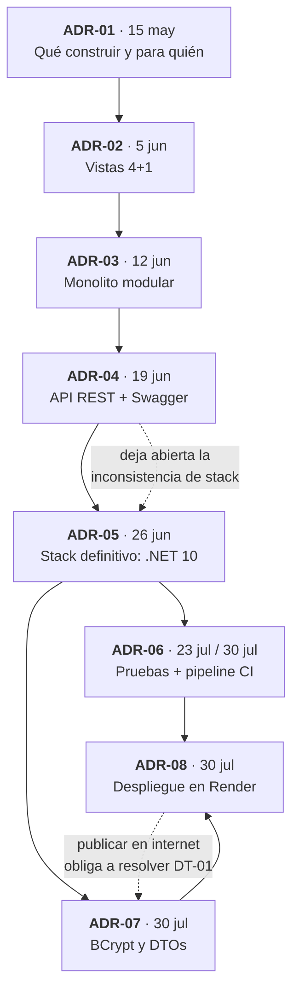

# CodeMX — Registro completo de decisiones de arquitectura

| Campo | Valor |
|-------|-------|
| Autor | Leonardo Balmes Solis |
| Proyecto | CodeMX — plataforma de retos de programación y cursos en español |
| Periodo | Unidad II (15/05/2026) → entrega final (30/07/2026) |
| Actualizado | 30/07/2026 |

Este documento es el índice consolidado de los **ocho ADRs** del proyecto. Cada uno vive en su
propio archivo; aquí quedan el resumen, el orden cronológico, cómo se relacionan entre sí y qué
decisiones corrigieron a otras anteriores.

---

## Tabla de decisiones

| # | Decisión | Fecha | Estado |
|---|----------|-------|--------|
| [ADR-01](ADR-01-Plataforma-de-Retos.md) | Construir CodeMX: plataforma de retos en español para estudiantes universitarios mexicanos | 15/05/2026 | Aceptado |
| [ADR-02](ADR-02-Vistas-Arquitectonicas.md) | Documentar la arquitectura con el modelo 4+1 (lógica, física, despliegue, procesos) | 05/06/2026 | Aceptado |
| [ADR-03](ADR-03-Monolito-Modular.md) | Adoptar un **monolito modular** con un esquema de base de datos por módulo | 12/06/2026 | Aceptado |
| [ADR-04](ADR-04-CodeMX-API-REST.md) | Exponer la funcionalidad mediante una **API REST** documentada con Swagger/OpenAPI | 19/06/2026 | Aceptado |
| [ADR-05](ADR-05-CodeMX-Stack-Definitivo.md) | Consolidar el stack en **ASP.NET Core (.NET 10)**, retirando la implementación paralela en Spring Boot | 26/06/2026 | Aceptado · resuelve la deuda que dejó abierta el ADR-04 |
| [ADR-06](ADR-06-Pruebas-y-Pipeline-CI.md) | Pruebas unitarias con **xUnit** y **pipeline de CI** en GitHub Actions | 23/07/2026 · revisado 30/07/2026 | Aceptado · ampliado a cinco jobs y a la aplicación real |
| [ADR-07](ADR-07-Manejo-de-Credenciales.md) | Hashear contraseñas con **BCrypt** y separar entidad de DTO | 30/07/2026 | Aceptado · cierra DT-01 |
| [ADR-08](ADR-08-Despliegue-Publico.md) | Desplegar como **imagen única en Render**, con la API sirviendo el frontend | 30/07/2026 | Aceptado |

---

## El recorrido, en orden

### De un cascarón MVC a una arquitectura evaluada

**Unidad II — el problema y la forma (ADR-01 a ADR-03).** El punto de partida fue un problema
concreto: no hay dónde practicar programación en español a nivel principiante. El ADR-01 fijó el
alcance y los atributos de calidad que importaban, entre ellos la integridad del ranking. El
ADR-02 documentó el sistema con las vistas 4+1, y el ADR-03 eligió el estilo: monolito modular,
no microservicios, con módulos por dominio que se comunican por interfaces explícitas y un
esquema de PostgreSQL por módulo. Esa decisión es la columna vertebral de todo lo que vino
después.

**Unidad III — la interfaz y la consolidación (ADR-04 y ADR-05).** El ADR-04 introdujo la API
REST, pero con una tensión declarada: la actividad exigía ASP.NET Core mientras el proyecto
estaba escrito en Spring Boot. El ADR-04 fue explícito en que dejaba esa deuda abierta. El
ADR-05 la cerró: se reimplementó el backend completo en ASP.NET Core conservando los mismos
módulos e interfaces, y se retiró la rama de Java. Que la arquitectura sobreviviera intacta al
cambio de lenguaje es la mejor prueba de que la modularidad del ADR-03 no era decorativa.

**Unidad IV — verificación, seguridad y entrega (ADR-06 a ADR-08).** El ADR-06 añadió pruebas y
un pipeline; su revisión del 30/07 corrigió un problema serio: el CI validaba un modelo de
dominio paralelo, no la aplicación real. El ADR-07 cerró DT-01, la deuda crítica de contraseñas
en texto plano, forzado por la decisión del ADR-08 de publicar la demo en internet. El ADR-08
cerró el ciclo con un despliegue reproducible del que el propio pipeline es la única vía.

---

## Deuda técnica: qué se cerró y qué sigue abierto

| Deuda | Origen | Estado |
|-------|--------|--------|
| Inconsistencia de stack (Spring Boot vs ASP.NET Core) | ADR-04 | **Cerrada** por el ADR-05 |
| DT-01 — contraseñas en texto plano y expuestas en la API | README, análisis de deuda técnica | **Cerrada** por el ADR-07 |
| El CI no probaba la aplicación real | Revisión del ADR-06 | **Cerrada** por el ADR-06 (revisión) |
| Sin autorización: el id de usuario se confía desde el cliente | ADR-07 | **Abierta** → riesgo **R-01** del ATAM |
| Cobertura baja fuera del módulo Usuarios | ADR-06 | **Abierta** → riesgo **R-02** del ATAM |
| Ejecución de código de usuario sin aislamiento reforzado | ADR-01, README | **Abierta** → riesgo **R-03** del ATAM |

Las decisiones se evalúan en profundidad —con riesgos, trade-offs y puntos de sensibilidad— en
la **[evaluación ATAM](ATAM-CodeMX.md)**.

---

## Cómo leer el resto de la documentación

- **[README](README.md)** — stack, arranque, deuda técnica y los diagramas **C4 niveles 1 a 3**.
- **[ATAM-CodeMX.md](ATAM-CodeMX.md)** — evaluación de la arquitectura: escenarios, riesgos,
  trade-offs y puntos de sensibilidad.
- **Vistas 4+1** — diagramas en `img/` (lógica, física, despliegue y procesos), referenciados
  desde el ADR-02.
