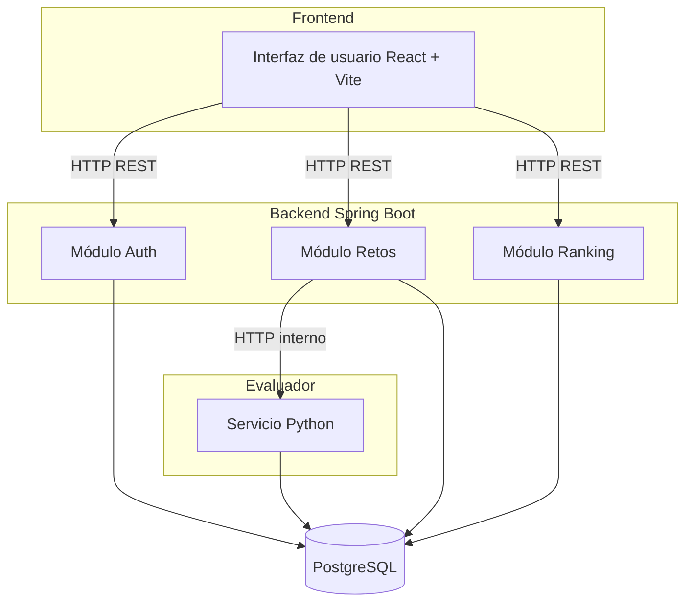
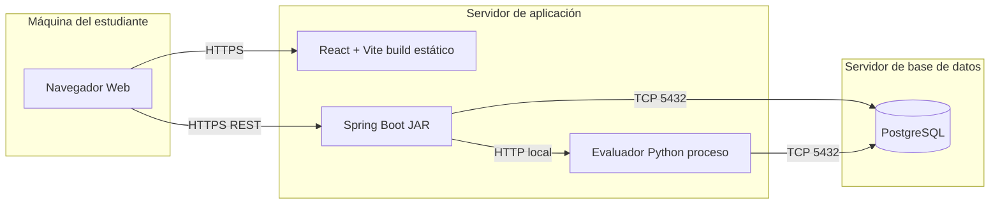
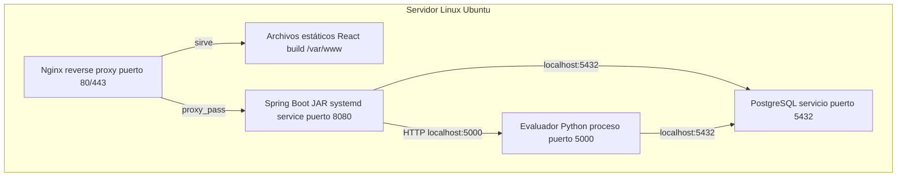
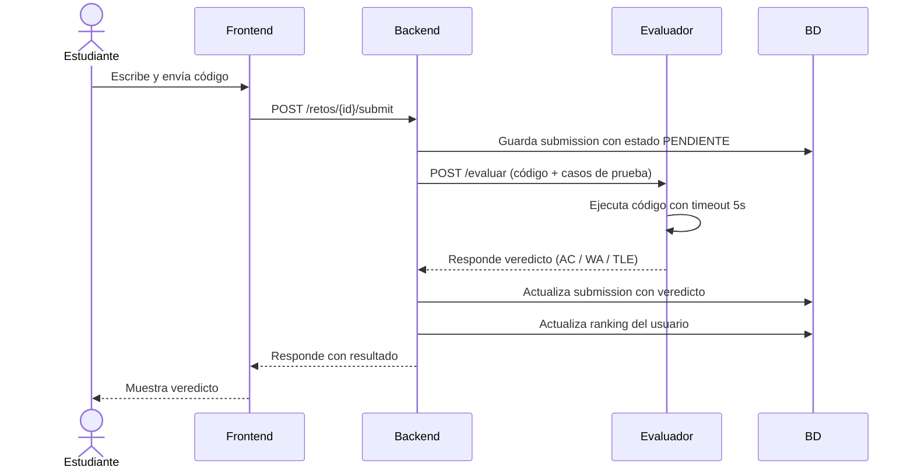

# ADR-02: Vistas Arquitectónicas de CodeMX

|Campo |Valor          |
|------|---------------|
|Autor |Leonardo Balmes|
|Fecha |05/06/2026     |
|Estado|Aceptado       |

-----

## Contexto

CodeMX es una plataforma de retos de programación en español dirigida a estudiantes universitarios en México. El sistema está compuesto por un frontend en React + Vite, un backend en Spring Boot con arquitectura de monolito modular, un evaluador de código en Python y una base de datos PostgreSQL. Para esta entrega necesito documentar formalmente cómo se organiza, comunica y despliega el sistema desde cuatro perspectivas distintas, usando las vistas arquitectónicas como herramienta de diseño.

-----

## Decisión

Adoptar el modelo de 4+1 vistas arquitectónicas (lógica, física, despliegue y procesos) para documentar la arquitectura de CodeMX.

### ¿Por qué?

Cada vista responde a una pregunta distinta sobre el sistema. La vista lógica muestra qué módulos existen y cómo se relacionan. La física muestra en qué nodos corre cada componente. La de despliegue describe cómo se instala y distribuye el sistema. La de procesos muestra cómo fluye la ejecución en tiempo real. Usar las cuatro juntas me permite detectar dependencias ocultas, planear el despliegue real y comunicar la arquitectura de forma completa.

### Alternativas consideradas

|Alternativa                               |Por qué la descarté                                                                                                      |
|------------------------------------------|-------------------------------------------------------------------------------------------------------------------------|
|Solo diagrama C4                          |Ya lo usé en el ADR-01. No cubre la vista de procesos ni el despliegue físico con suficiente detalle.                    |
|Diagrama UML de clases único              |Muestra la estructura interna del código pero no cómo se despliega ni cómo fluyen los procesos en ejecución.             |
|Documentación en texto plano sin diagramas|No es suficiente para comunicar la arquitectura de un sistema con múltiples componentes que corren en procesos separados.|

-----

## Consecuencias

**Lo que gano:**

- Técnica: tener la vista de procesos me obligó a pensar en los puntos de falla durante la evaluación de código, lo que me ayudó a identificar que el evaluador Python necesita un timeout explícito para no bloquear al backend.
- Proceso: con la vista de despliegue tengo una guía clara de qué instalar y en qué orden cuando quiera levantar el sistema en un servidor real, no solo en local.

**Lo que sacrifico o asumo:**

- Limitación técnica: al ser monolito modular, la vista física es sencilla (todo en un servidor). Si el proyecto creciera, esta vista quedaría desactualizada rápido y tendría que migrar a microservicios.
- Deuda: los diagramas de proceso asumen que el evaluador responde siempre. No tengo aún implementado el manejo de errores cuando el evaluador se cae o tarda demasiado.

-----

## Diagramas

### Vista Lógica

Muestra los módulos principales del sistema y sus relaciones.

-----

### Vista Física

Muestra en qué nodos de hardware o máquinas corre cada componente.

-----

### Vista de Despliegue

Muestra cómo se instala y distribuye el sistema en el entorno de producción.

-----

### Vista de Procesos

Muestra el flujo de ejecución cuando un estudiante envía una solución.

