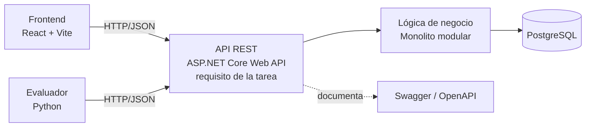

# ADR-04: Incorporación de una API REST para exponer la funcionalidad del sistema

| Campo  | Valor |
|--------|-------|
| Autor  | Leonardo |
| Fecha  | 19/06/2026 |
| Estado | `Aceptado` |

---

## Contexto

CodeMX es una plataforma de retos de programación en español dirigida a estudiantes universitarios mexicanos. El sistema necesita que el frontend (React + Vite), el evaluador de código en Python y, eventualmente, otros clientes puedan comunicarse con la lógica de negocio sin estar acoplados a ella. Hasta ahora la funcionalidad vivía dentro del monolito modular sin un punto de entrada formal y estandarizado para los clientes.

El problema concreto es que el frontend y el evaluador necesitan consumir operaciones del backend (gestionar retos, enviar soluciones, obtener resultados) a través de la red, con un contrato claro y predecible. Sin una interfaz definida, cada cliente tendría que conocer detalles internos del sistema, lo que dificulta el mantenimiento y el trabajo en paralelo. Las restricciones que influyeron fueron el tiempo limitado del semestre, que trabajo solo en este proyecto individual, y que ya conozco el estilo REST por la materia.

Es importante aclarar una restricción de origen externo: la actividad exige implementar los endpoints con **ASP.NET Core Web API**. El backend de CodeMX se diseñó originalmente con Spring Boot (Java), como quedó documentado en los ADRs anteriores, y esa sigue siendo mi preferencia para el proyecto. La adopción de ASP.NET Core en este ADR responde al requisito de la tarea y no a un cambio de criterio técnico de mi parte. La coherencia entre ambos enfoques se aclarará más adelante.

---

## Decisión

Incorporé una **API REST** documentada con **Swagger (OpenAPI)** como contrato y herramienta de exploración de los endpoints. Por requisito de la actividad, los endpoints se implementan con **ASP.NET Core Web API** (Swashbuckle para Swagger), a pesar de que el backend de CodeMX se concibió con Spring Boot. Esta diferencia se resolverá en una aclaración posterior.

### ¿Por qué?

REST resuelve el problema de comunicación cliente-servidor con un contrato uniforme basado en recursos y los verbos HTTP estándar (GET, POST, PUT, DELETE). Cada recurso de CodeMX —retos, soluciones, usuarios— se expone como un endpoint predecible, lo que permite que el frontend en React y el evaluador en Python consuman el backend sin conocer su implementación interna. Al ser un estilo sin estado, cada petición es independiente, lo que facilita escalar y depurar.

ASP.NET Core Web API me da enrutamiento por atributos, serialización JSON automática y un ecosistema maduro para validación y manejo de errores. Swagger genera documentación interactiva directamente desde el código, que es el estándar de la industria para publicar y validar endpoints, y me permite probar cada operación desde el navegador sin escribir un cliente aparte.

### Alternativas consideradas

| Alternativa | Por qué la descarté |
|-------------|---------------------|
| Spring Boot REST (Java) | Es mi opción preferida y la base original de CodeMX, pero la actividad exige ASP.NET Core; la decisión de framework quedó condicionada por el requisito de la tarea, no por criterio técnico. |
| GraphQL | Aporta consultas flexibles, pero añade complejidad de esquema y resolvers que no justifican el tamaño del proyecto; mis clientes tienen necesidades de datos predecibles que REST cubre bien. |
| gRPC | Excelente rendimiento y contratos fuertes, pero su soporte nativo en navegadores es limitado y complicaría el consumo desde el frontend React. |
| Acoplamiento directo (sin API) | Obligaría a cada cliente a conocer la lógica interna del backend, rompería el desacoplamiento del monolito modular y haría imposible que clientes externos consumieran el sistema. |

---

## Consecuencias

**✅ Lo que gano:**

- **Técnica:** El frontend, el evaluador y futuros clientes consumen un contrato uniforme basado en recursos y verbos HTTP, lo que desacopla la lógica de negocio de quien la consume y facilita escalar o reemplazar clientes sin tocar el backend.
- **Proceso/equipo:** Swagger sirve como documentación viva y siempre actualizada de los endpoints, así que puedo desarrollar y probar el frontend contra un contrato claro sin depender de notas externas o explicaciones manuales.

**⚠️ Lo que sacrifico o asumo:**

- **Limitación técnica:** REST puede provocar *over-fetching* o *under-fetching* (traer más o menos datos de los necesarios) y, en flujos complejos, obliga a varias peticiones donde un solo intercambio sería más eficiente.
- **Deuda o riesgo:** A medida que crezca el sistema tendré que versionar la API y mantener compatibilidad hacia atrás, además de gestionar autenticación y autorización en los endpoints. A esto se suma la inconsistencia de stack entre ASP.NET Core (exigido por la tarea) y Spring Boot (base original del proyecto), que deberá resolverse más adelante para no fragmentar la arquitectura.

---

## Diagrama

---

## Declaración de uso de IA

Se utilizó una herramienta de IA únicamente para buscar información.
