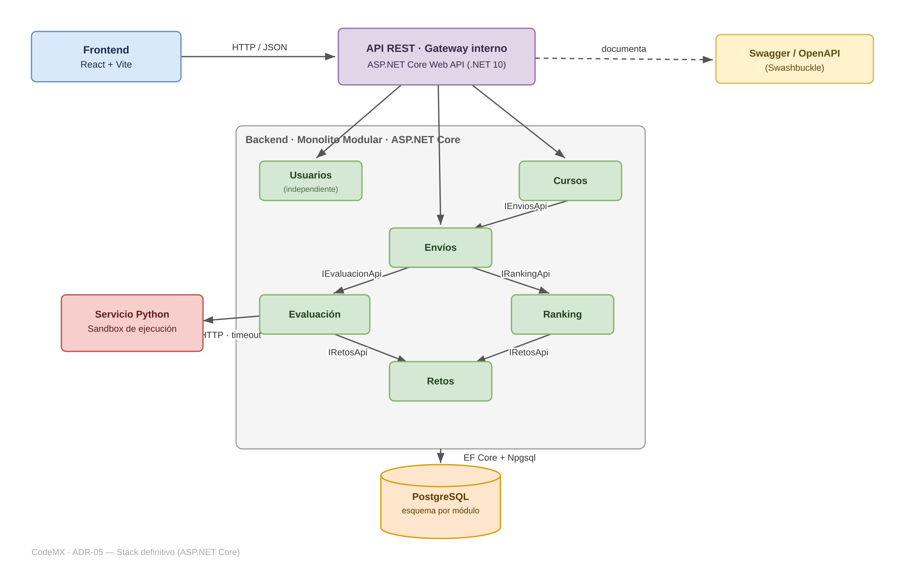

# ADR-05: Consolidación del stack definitivo del backend tras implementar Spring Boot y ASP.NET Core

| Campo  | Valor |
|--------|-------|
| Autor  | Leonardo Balmes |
| Fecha  | 26/06/2026 |
| Estado | `Aceptado` · Resuelve la inconsistencia de stack que el ADR-04 dejó pendiente |

---

## Contexto

CodeMX es una plataforma web de retos de programación en español para estudiantes universitarios mexicanos. A lo largo de los ADRs anteriores el sistema quedó definido como un **monolito modular** sobre esquema cliente-servidor, con un frontend en React + Vite, una base de datos PostgreSQL como única fuente de verdad y un servicio de ejecución de código en Python aislado. El backend se organiza en módulos por dominio: `usuarios`, `retos`, `envios`, `evaluacion`, `ranking` y, más adelante, `cursos` (la plataforma de aprendizaje).

El backend se concibió originalmente en **Spring Boot / Java** (ADR-01 y ADR-03), por preferencia técnica y porque es el stack que mejor manejo. Sin embargo, el ADR-04 introdujo una restricción externa: la actividad exigía exponer la API REST con **ASP.NET Core Web API**, documentada con Swagger/OpenAPI. Para cumplir, **reimplementé el backend completo en ASP.NET Core (C#, .NET 10)** conservando exactamente los mismos módulos, las mismas interfaces explícitas entre ellos (gateway + APIs públicas por módulo) y la misma separación lógica en PostgreSQL (un esquema por módulo).

El ADR-04 reconoció esto como una deuda y la dejó explícitamente abierta: *"la inconsistencia de stack entre ASP.NET Core (exigido por la tarea) y Spring Boot (base original del proyecto) deberá resolverse más adelante para no fragmentar la arquitectura"*. Hoy el proyecto tiene **dos implementaciones funcionalmente equivalentes** del mismo backend, y mantener ambas no es sostenible.

Condiciones que influyen en esta decisión:
- Es un proyecto individual con tiempo limitado: no puedo mantener dos bases de código en paralelo.
- La actividad de la materia exige ASP.NET Core; el criterio de evaluación está atado a ese stack.
- **Lo aprendido al portar el sistema:** las fronteras del monolito modular se tradujeron 1:1 de Java a C#. Los módulos, sus interfaces (`IEvaluacionApi`, `IRankingApi`, `IRetosApi`…), el gateway y los esquemas por módulo se reprodujeron sin rediseñar nada. Esto demostró que **el valor arquitectónico vive en el diseño (ADR-03), no en el framework**, y que elegir uno u otro es una decisión de bajo riesgo técnico.

---

## Decisión

Adopto **ASP.NET Core Web API (C#, .NET 10) como la implementación única y definitiva del backend** de CodeMX. La implementación en Spring Boot queda **archivada como referencia histórica** (en su rama), no como código vivo. Con esto se cierra la inconsistencia que el ADR-04 dejó pendiente.

El estilo arquitectónico no cambia: se mantiene el **monolito modular** del ADR-03, con los mismos módulos por dominio, las mismas interfaces explícitas entre módulos, el gateway/API REST como punto de entrada, Swagger/OpenAPI como contrato y PostgreSQL como única fuente de verdad con un esquema por módulo. Lo único que se consolida es el **stack de implementación**.

Concretamente, el stack definitivo es:
- **API / Web:** ASP.NET Core Web API (controllers REST por recurso, agrupados en el gateway).
- **Documentación del contrato:** Swagger/OpenAPI vía Swashbuckle.
- **Persistencia:** Entity Framework Core con el proveedor Npgsql para PostgreSQL, con un esquema por módulo.
- **Inyección de dependencias:** el contenedor nativo de ASP.NET Core para inyectar las interfaces públicas de cada módulo.
- **Evaluador:** el módulo `evaluacion` se comunica con el servicio Python externo por HTTP (HttpClient) con timeout explícito.

### ¿Por qué?

El monolito modular ya estaba decidido y validado; lo que faltaba era resolver **con qué stack se mantiene**. ASP.NET Core resuelve el problema concreto por varias razones específicas:

- **Cumple el requisito externo sin conflicto.** El criterio de evaluación de la actividad (ADR-04) exige ASP.NET Core. Elegir el stack que ya satisface esa restricción elimina la fricción entre "mi preferencia" y "lo que se evalúa", que era justamente la tensión que generó la deuda.
- **Cubre técnicamente todo lo que cubría Spring Boot.** EF Core + Npgsql equivalen a Spring Data JPA + el driver de PostgreSQL; Swashbuckle equivale a springdoc/OpenAPI; el contenedor de DI de .NET equivale al de Spring. No pierdo ninguna capacidad: ORM, transacciones locales, esquemas por módulo, REST y documentación automática están todas disponibles.
- **Es la implementación que ya está completa y verificada de extremo a extremo**, incluyendo el módulo `cursos`. Elegirla evita volver a portar trabajo y dejar features a medias en el stack "perdedor".
- **Elimina la fragmentación, que era el riesgo real.** Para una sola persona, mantener dos backends significa duplicar pruebas, esquemas, despliegues y correcciones de bugs. Un único stack concentra el esfuerzo donde se evalúa el proyecto.
- **La portabilidad demostrada vuelve segura la decisión.** Como las fronteras entre módulos se tradujeron sin rediseño, la inversión arquitectónica (ADR-03) se conserva intacta con cualquier framework. Por eso puedo decidir el stack por criterios pragmáticos (requisito + estado actual) sin comprometer el diseño.

### Alternativas consideradas

*(Mínimo 3 filas)*

| Alternativa | Por qué la descarté |
|-------------|---------------------|
| **Mantener Spring Boot como definitivo y descartar ASP.NET Core** | Es mi preferencia original y el stack que más domino, pero incumpliría el requisito explícito de la actividad (ADR-04) y obligaría a tirar la implementación de ASP.NET que ya está completa, verificada y alineada con el criterio de evaluación. |
| **Mantener ambos stacks en paralelo** | Es exactamente la fragmentación que el ADR-04 advirtió. Para un proyecto individual implica duplicar el mantenimiento (dos bases de código, dos configuraciones de PostgreSQL, dos despliegues) sin ningún beneficio: la lógica de negocio es la misma. Inmanejable con el tiempo disponible. |
| **Reescribir el backend en un tercer stack (Node.js + Express, etc.)** | No aporta ninguna ventaja sobre lo ya construido, descarta el trabajo hecho en los dos stacks y reintroduce el costo de aprender y configurar seguridad, validación y ORM desde cero. |
| **Extraer la lógica a una librería neutra y mantener dos "cascarones" web (Java y C#)** | Sobreingeniería para un proyecto académico individual. No existe un requisito real de exponer la misma lógica desde dos frameworks; el costo de diseñar y sincronizar esa capa compartida supera con creces cualquier beneficio. |

---

## Consecuencias

**✅ Lo que gano:**

- **Técnica:** un solo stack coherente que satisface el requisito de la materia. El contrato REST documentado con Swagger ya existe, y EF Core mantiene PostgreSQL como única fuente de verdad con esquemas por módulo. Lo más importante: la arquitectura modular del ADR-03 (módulos por dominio, interfaces explícitas, gateway, evaluador aislado) **se conserva sin cambios**, así que la decisión consolida el stack sin tocar el diseño.
- **Proceso o equipo:** dejo de mantener dos bases de código y concentro todo el avance —features nuevas como autenticación, integración real del servicio Python, versionado de la API— en un solo lugar. La ambigüedad "¿cuál es el backend oficial?" desaparece, lo que simplifica la entrega y la evaluación.

**⚠️ Lo que sacrifico o asumo:**

- **Limitación técnica:** renuncio a la ventaja de familiaridad con Spring Boot/Java que declaré en el ADR-01. Debo consolidar mi conocimiento de C#, ASP.NET Core y Entity Framework Core (migraciones, hosting con Kestrel, despliegue de .NET) para operar y evolucionar el sistema con soltura, no solo para que compile.
- **Deuda o riesgo:** la implementación en Spring Boot queda como referencia "muerta" que se desactualizará con cada cambio del backend definitivo; si un requisito futuro volviera a exigir Java, habría que re-portar. Además **siguen pendientes** las deudas heredadas que ningún ADR ha cerrado todavía: el aislamiento real del sandbox Python por seguridad, la autenticación/autorización (JWT) en los endpoints, y el versionado de la API para mantener compatibilidad hacia atrás cuando el sistema crezca.

## Diagrama

Stack definitivo consolidado (el estilo arquitectónico del ADR-03 se mantiene; solo se fija la implementación):

---

## Relación con otros ADRs

- **Resuelve** la inconsistencia de stack que el **ADR-04** dejó explícitamente pendiente.
- **Conserva** el estilo arquitectónico definido en el **ADR-03** (monolito modular con interfaces explícitas) y las vistas del **ADR-02**: lo que cambia es la tecnología de implementación, no la estructura.
- **Actualiza** la decisión de backend del **ADR-01** (Spring Boot) por la restricción externa documentada en el ADR-04.

## Declaración de uso de IA

Se utilizó una herramienta de IA para apoyar la redacción y la comparación entre ambas implementaciones.
