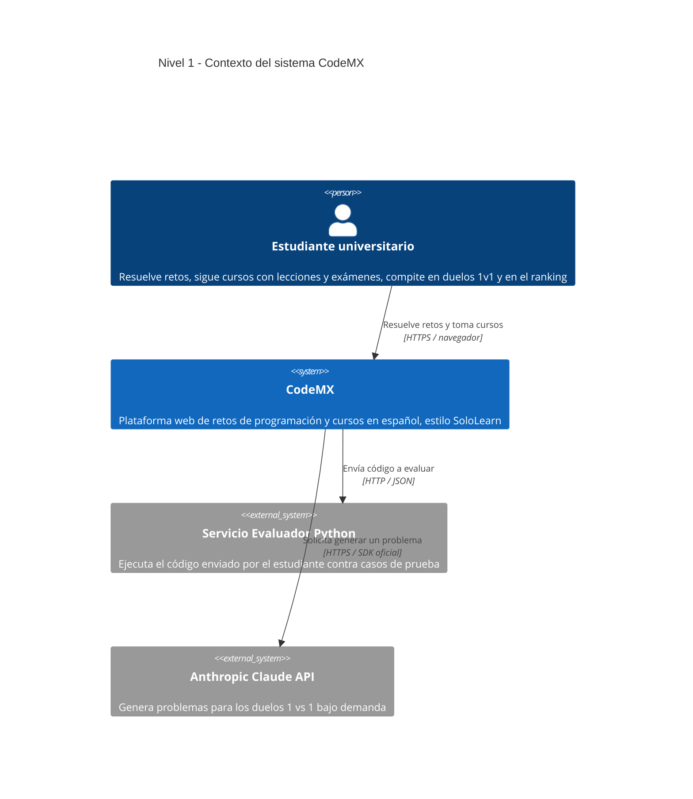
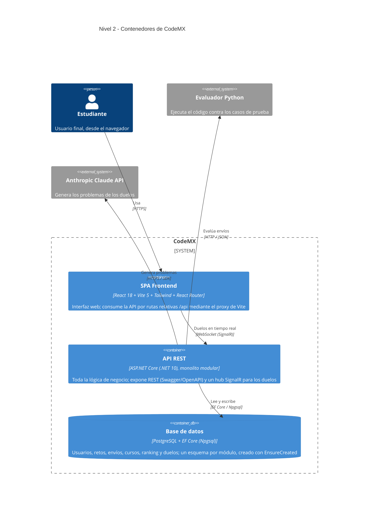
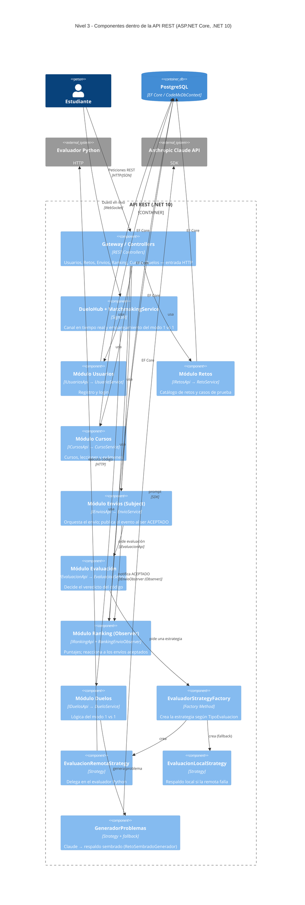

# Arquitectura de CodeMX — Modelo C4

Este documento describe la arquitectura de **CodeMX** (plataforma web de retos de
programación y cursos en español) usando el **Modelo C4**, versionada como código.
Todos los diagramas están escritos en **Mermaid** dentro de este `.md`; GitHub los
renderiza automáticamente.

El Modelo C4 describe un sistema en niveles de *zoom* progresivo:

| Nivel | Diagrama | Hace zoom en… |
|-------|----------|---------------|
| 1 | Contexto | El sistema completo y su entorno |
| 2 | Contenedores | Las piezas técnicas grandes que lo forman |
| 3 | Componentes | El interior de la pieza principal (la API) |

> Contexto técnico de referencia: monolito modular en **ASP.NET Core (.NET 10)** con
> **PostgreSQL** (EF Core), frontend **React + Vite**, un **evaluador de código en Python**
> por HTTP y la **API de Anthropic (Claude)** para generar problemas de duelo. Ver los
> `ADR-0X-*.md` para las decisiones de arquitectura.

---

## Nivel 1 — Contexto

> **¿Para quién es?** Para cualquiera (incluidos no técnicos: profesores, evaluadores,
> nuevos integrantes). **¿Qué pregunta responde?** *¿Qué es CodeMX, quién lo usa y con
> qué sistemas externos habla?* — sin entrar en tecnología interna.

**Lectura del diagrama:** el único usuario es el **estudiante**. CodeMX se apoya en dos
sistemas externos: el **evaluador Python** (decide si el código pasa los casos de prueba)
y la **API de Claude** (inventa los problemas de los duelos). Todo lo demás vive dentro
del sistema y se detalla en los niveles siguientes.

---

## Nivel 2 — Contenedores

> **¿Para quién es?** Para el equipo técnico (desarrolladores, DevOps). **¿Qué pregunta
> responde?** *¿De qué piezas ejecutables se compone CodeMX, qué tecnología usa cada una
> y cómo se comunican entre sí?* Un "contenedor" en C4 es algo que corre por separado
> (una app, una API, una base de datos), no un contenedor de Docker.

**Lectura del diagrama:** son **tres contenedores propios**. El **SPA de React** solo
pinta la interfaz y llama al backend (por el proxy `/api`, así no hay URLs incrustadas).
La **API .NET** concentra la lógica y habla con tres cosas: la **base PostgreSQL** (vía EF
Core), el **evaluador Python** (HTTP) y la **API de Claude** (SDK). Los duelos usan un
canal aparte en **tiempo real (SignalR/WebSocket)**, no REST.

---

## Nivel 3 — Componentes (dentro de la API REST)

> **¿Para quién es?** Para quien programa dentro del backend. **¿Qué pregunta responde?**
> *¿Qué hay dentro del contenedor "API REST": qué controladores, servicios de dominio y
> patrones de diseño lo forman y cómo colaboran?* Aquí se ven los **patrones GoF** ya
> implementados: **Strategy**, **Factory Method** y **Observer**.

**Lectura del diagrama y patrones GoF:**

- **Arquitectura por módulos.** Cada módulo expone una **interfaz pública** (`I…Api`) y
  esconde su `Service` + `Repository`. Los módulos se hablan solo por esas interfaces, no
  por sus clases internas (monolito modular, ADR-03).
- **Strategy** — `IEvaluacionStrategy` tiene dos implementaciones intercambiables:
  `EvaluacionRemotaStrategy` (evaluador Python) y `EvaluacionLocalStrategy` (respaldo). El
  mismo patrón aparece en Duelos con `IGeneradorProblemas` (Claude vs. sembrado).
- **Factory Method** — `EvaluadorStrategyFactory` decide **qué** estrategia crear según el
  `TipoEvaluacion`, e intenta la remota cayendo a la local.
- **Observer** — `EnvioService` (sujeto) publica `EnvioAceptadoEvent` cuando un envío es
  aceptado por primera vez; `RankingEnvioObserver` está suscrito como `IEnvioObserver` y
  actualiza el ranking. Así **Envíos no conoce a Ranking**: mañana podrían sumarse otros
  observadores (logros, notificaciones) sin tocar Envíos.

---

## Declaración de uso de IA

Los **diagramas y textos de este documento** se elaboraron con apoyo de **Claude Code
(Claude Opus 4.8)**, a partir de una lectura del código real del repositorio (`Program.cs`,
los módulos de `backend/Modules/`, los controladores del `Gateway/` y el hub de tiempo
real). El contenido fue revisado para que refleje la arquitectura efectivamente
implementada. El modelo C4 elegido, la validación de cada nivel y las decisiones de
diseño descritas corresponden al autor del proyecto.
