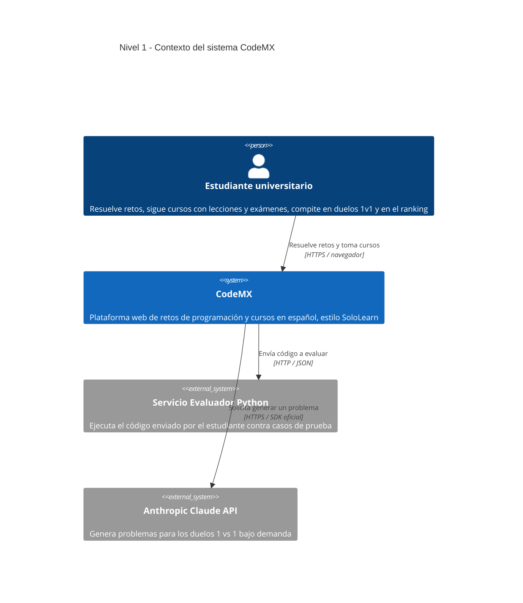

# Arquitectura de CodeMX — Modelo C4

Este documento describe la arquitectura de **CodeMX** (plataforma web de retos de
programación y cursos en español) usando el **Modelo C4**, versionada como código.
Todos los diagramas están escritos en **Mermaid** dentro de este `.md`; GitHub los
renderiza automáticamente.

El Modelo C4 describe un sistema en niveles de *zoom* progresivo:

| Nivel | Diagrama | Hace zoom en… |
|-------|----------|---------------|
| 1 | Contexto | El sistema completo y su entorno |
| 2 | Contenedores | Las piezas técnicas grandes que lo forman |
| 3 | Componentes | El interior de la pieza principal (la API) |

> Contexto técnico de referencia: monolito modular en **ASP.NET Core (.NET 10)** con
> **PostgreSQL** (EF Core), frontend **React + Vite**, un **evaluador de código en Python**
> por HTTP y la **API de Anthropic (Claude)** para generar problemas de duelo. Ver los
> `ADR-0X-*.md` para las decisiones de arquitectura.

---

## Nivel 1 — Contexto

> **¿Para quién es?** Para cualquiera (incluidos no técnicos: profesores, evaluadores,
> nuevos integrantes). **¿Qué pregunta responde?** *¿Qué es CodeMX, quién lo usa y con
> qué sistemas externos habla?* — sin entrar en tecnología interna.

**Lectura del diagrama:** el único usuario es el **estudiante**. CodeMX se apoya en dos
sistemas externos: el **evaluador Python** (decide si el código pasa los casos de prueba)
y la **API de Claude** (inventa los problemas de los duelos). Todo lo demás vive dentro
del sistema y se detalla en los niveles siguientes.
