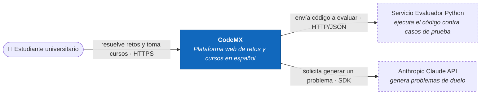
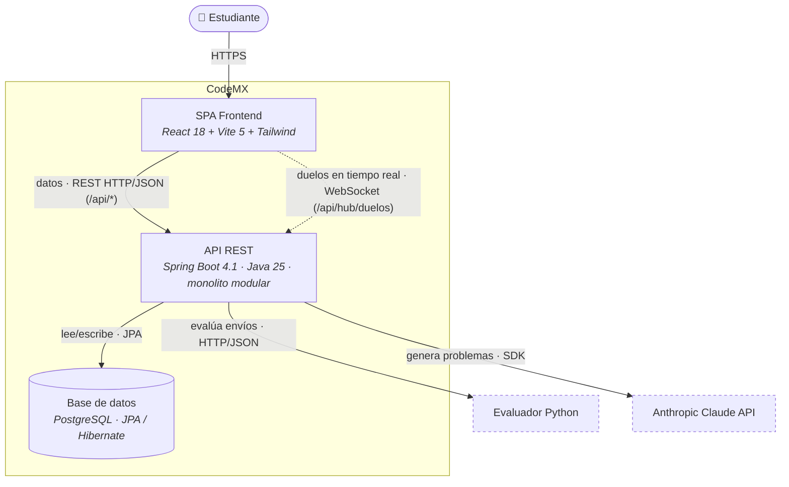
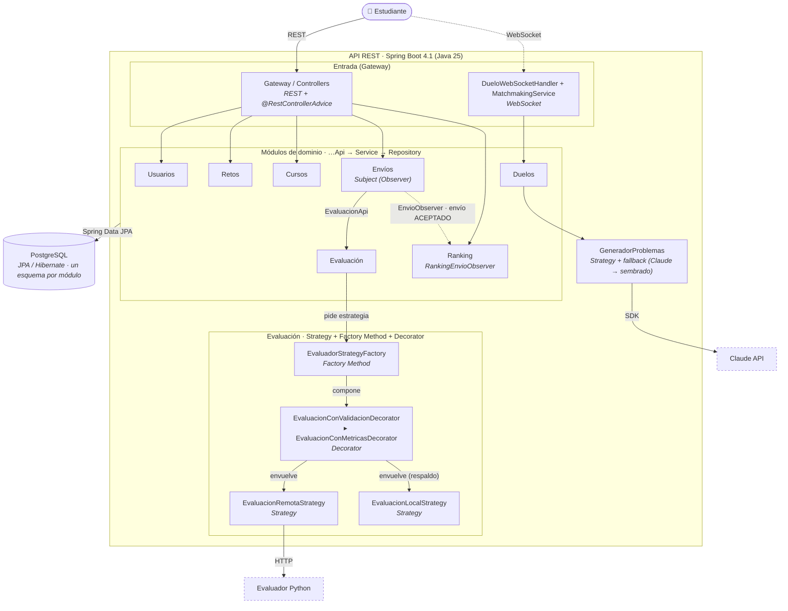

# CodeMX

Plataforma web de retos de programación y cursos en español, pensada para
estudiantes universitarios mexicanos (estilo SoloLearn). Permite resolver retos,
evaluar el código contra casos de prueba, seguir cursos con lecciones y exámenes,
y competir en un ranking.

## Stack

| Capa | Tecnología |
|------|------------|
| Frontend | React 18 + Vite 5 + Tailwind CSS + React Router |
| Backend | Spring Boot 4.1 sobre **Java 25**, compilado con Maven |
| Persistencia | Spring Data JPA / Hibernate + PostgreSQL, un esquema por módulo |
| Documentación de la API | OpenAPI 3 con springdoc (`/swagger`) |
| Tiempo real | WebSocket nativo de Spring, en `/api/hub/duelos` |
| Generación de problemas | SDK oficial `anthropic-java` (API de Claude), con respaldo sembrado |
| Evaluador de código | Servicio Python externo por HTTP (opcional; hay estrategia local de respaldo) |

Es un **monolito modular**: el backend se divide en módulos por dominio
(`usuarios`, `retos`, `envios`, `evaluacion`, `ranking`, `cursos`, `duelos`), cada uno con
su interfaz pública (`…Api`) que esconde su `Service` y su `Repository`. Cada módulo tiene
además **su propio esquema de PostgreSQL**. Ver las decisiones de arquitectura en los
archivos `ADR-0X-*.md`; el stack vigente es el del **ADR-05**.

### Patrones de diseño (GoF) en el backend

- **Strategy** — `EvaluacionStrategy` con dos implementaciones intercambiables:
  `EvaluacionRemotaStrategy` (servicio Python) y `EvaluacionLocalStrategy`.
- **Factory Method** — `EvaluadorStrategyFactory` crea la estrategia según
  `TipoEvaluacion`; el servicio intenta la remota y cae a la local.
- **Observer** — el módulo *Envíos* publica un evento cuando un envío es aceptado;
  `RankingEnvioObserver` se suscribe y actualiza el ranking, sin acoplar Envíos a Ranking.
- **Decorator** — `EvaluacionDecorator` envuelve cualquier `EvaluacionStrategy` y le añade
  comportamiento sin modificarla ni heredar de ella: `EvaluacionConValidacionDecorator`
  rechaza código vacío o que excede el límite configurado antes de ejecutarlo, y
  `EvaluacionConMetricasDecorator` mide el tiempo real de la evaluación y registra el
  veredicto. La *factory* compone ambos al crear la estrategia, de modo que las decoraciones
  aplican por igual a la remota y a la local.

---

## Deuda técnica identificada

### DT-01 — Autenticación y exposición de credenciales inseguras

**Estado:** abierta<br>
**Prioridad:** crítica<br>
**Tipo:** seguridad y diseño<br>
**Componentes afectados:** frontend, API de Usuarios y base de datos

#### Evidencia

Aunque el atributo se llama `PasswordHash`, actualmente la aplicación trata su valor
como una contraseña en texto plano:

- `frontend/src/pages/Registro.jsx` y `frontend/src/pages/Login.jsx` capturan la
  contraseña en `passwordHash` y la envían directamente a la API.
- `backend-java/src/main/java/mx/codemx/modules/usuarios/UsuarioService.java` autentica
  con la comparación `u.getPasswordHash().equals(passwordHash)`; no existe una función
  de hash ni una verificación criptográfica.
- `backend-java/src/main/java/mx/codemx/gateway/UsuariosController.java` devuelve el
  objeto `UsuarioDominio` completo en creación, consulta, listado e inicio de sesión, y
  ese objeto incluye `passwordHash`. Por lo tanto, la credencial forma parte de las
  respuestas JSON.
- No existe un mecanismo de sesión o token. El frontend conserva únicamente el objeto
  del usuario y otras operaciones confían en identificadores de usuario enviados por
  el cliente.

#### Impacto

Una lectura de la base de datos o una respuesta interceptada permite obtener las
contraseñas reutilizables de los usuarios. Además, cualquier consumidor de la API
puede consultar la lista de usuarios y recibir sus credenciales. La ausencia de
autenticación verificable también permite suplantar a otro usuario enviando su
identificador en solicitudes de envíos, cursos o duelos.

Esta deuda debe resolverse antes de publicar CodeMX fuera de un entorno local. Su
severidad es **crítica** porque compromete confidencialidad, autenticidad y datos de
todos los usuarios.

#### Propuesta concreta de solución

1. **Separar contratos y entidad.** Crear DTOs específicos: `RegistroRequest`,
   `LoginRequest` y `UsuarioResponse`. Los DTOs de entrada recibirán `password`; el DTO
   de salida solo expondrá `id`, `nombre`, `email` y `fechaRegistro`. La entidad de
   persistencia conservará `passwordHash`, marcado además con `@JsonIgnore` como
   defensa adicional.
2. **Aplicar hash seguro en el servidor.** Agregar `spring-boot-starter-security` y
   registrar un `PasswordEncoder` (`BCryptPasswordEncoder`, que genera un salt por
   usuario). Al registrar, guardar `encoder.encode(password)`; al iniciar sesión, usar
   `encoder.matches(password, hashGuardado)`. La contraseña nunca se debe registrar en
   logs, devolver por JSON ni persistir sin hash.
3. **Implementar autenticación.** Emitir un token JWT de corta duración tras un login
   válido, configurar una `SecurityFilterChain` con `oauth2ResourceServer().jwt()` y
   exigir autenticación en las rutas privadas. El backend debe tomar el identificador
   del usuario desde los *claims* del token, no desde un valor confiado al cliente.
4. **Migrar datos existentes.** Como no es posible transformar contraseñas planas en
   hashes sin conocer de forma segura su procedencia, invalidar las credenciales
   actuales y solicitar restablecimiento. Sustituir `ddl-auto: update` por **Flyway**
   con migraciones versionadas, para que el cambio de esquema sea reproducible y no
   quede a merced de lo que Hibernate infiera al arrancar.
5. **Añadir pruebas automatizadas.** Con `spring-boot-starter-test` y `MockMvc`, cubrir
   registro, login correcto e incorrecto, respuestas sin `passwordHash`, acceso sin
   token (`401`) y rechazo de un `usuarioId` que no coincida con el sujeto autenticado.

#### Criterios de aceptación

- Ninguna respuesta de `/api/usuarios` contiene `password` ni `passwordHash`.
- La contraseña almacenada no coincide con la recibida y se valida mediante un
  algoritmo de hash con salt.
- Las rutas privadas responden `401` sin un token válido y `403` cuando el usuario no
  tiene permiso sobre el recurso.
- La identidad usada para crear envíos, registrar progreso y participar en duelos se
  obtiene del token autenticado.
- Las pruebas de autenticación y autorización se ejecutan automáticamente en CI.

#### Estimación y seguimiento

| Fase | Trabajo | Estimación |
|------|---------|------------|
| 1 | DTOs, ocultamiento de credenciales y hash de contraseñas | 1 día |
| 2 | JWT, autorización de endpoints y adaptación del frontend | 2 días |
| 3 | Migraciones con Flyway, pruebas de integración y documentación de configuración | 1–2 días |

**Estimación total:** 4–5 días de desarrollo. El trabajo puede dividirse en entregas,
pero las fases 1 y 2 deben desplegarse juntas para no mantener contratos inseguros.

### Riesgo técnico relacionado — ejecución local de código

`backend-java/src/main/java/mx/codemx/modules/evaluacion/EvaluacionLocalStrategy.java`
escribe código proporcionado por el usuario en un archivo temporal y lo ejecuta con
`python3` mediante `ProcessBuilder`, en el mismo sistema operativo que la API. El límite
de tiempo (`evaluador.timeout-ms`) detiene procesos largos, y `EvaluacionConValidacionDecorator`
acota el tamaño del código (`evaluador.limite-caracteres`), pero **nada restringe acceso a
archivos, red, memoria, CPU ni llamadas al sistema**. Por ello, esta estrategia de respaldo
no debe habilitarse en un entorno compartido o de producción.

La remediación propuesta es ejecutar cada evaluación en un *sandbox* aislado
(contenedor efímero sin red, usuario sin privilegios, sistema de archivos de solo
lectura y límites de CPU, memoria, procesos y tiempo). La API debe comunicarse
exclusivamente con ese servicio; si no está disponible, el envío debe permanecer en
cola o devolver un error controlado, sin ejecutar código dentro del proceso anfitrión.
Se considera resuelto cuando pruebas de escape confirman que el programa evaluado no
puede leer archivos del host, abrir conexiones ni exceder los recursos asignados.

---

## Cómo prender el proyecto (básico)

### Requisitos previos

- [JDK 25](https://adoptium.net/) (`java -version`)
- [Maven 3.9+](https://maven.apache.org/) (`mvn -v`), o el wrapper del proyecto
- [Node.js 18+](https://nodejs.org/) y npm (`node --version`)
- [PostgreSQL](https://www.postgresql.org/) corriendo en `localhost:5432`
  - Base/usuario por defecto: base `codemx_spring`, usuario `postgres`, sin contraseña.
  - Ajusta `spring.datasource.*` en `backend-java/src/main/resources/application.yml`
    si tu Postgres es distinto.
  - El backend **crea los esquemas y las tablas y siembra retos y cursos de ejemplo
    automáticamente** al arrancar (`ddl-auto: update` + `DataSeeder`), no hace falta
    correr migraciones a mano.
- *(Opcional)* `ANTHROPIC_API_KEY` en el entorno, para que los duelos generen su
  problema con la API de Claude. Sin ella se usan retos sembrados de respaldo.

### 1) Backend (Java + Spring Boot)

```bash
cd backend-java
mvn spring-boot:run
```

Queda escuchando en `http://0.0.0.0:8080`.
Documentación interactiva de la API: `http://localhost:8080/swagger`

> Las tablas **no viven en el esquema `public`**: cada módulo tiene el suyo
> (`usuarios`, `retos`, `envios`, `cursos`, `ranking`, `duelos`). Para consultarlas hay que
> calificar el nombre, por ejemplo `SELECT * FROM usuarios.usuarios;`.

### 2) Frontend (React + Vite)

En otra terminal:

```bash
cd frontend
npm install        # solo la primera vez
npm run dev
```

Queda en `http://localhost:5173`. Vite reenvía las llamadas `/api/*` al backend
en `localhost:8080` mediante un *proxy*, así que el frontend usa rutas relativas
y no hay URLs incrustadas que cambiar.

> Abre `http://localhost:5173` en el navegador y listo.

---

## Acceder desde otra máquina (red local / LAN)

Por defecto un proyecto de desarrollo solo escucha en `localhost`, por lo que
otra computadora de la red **no puede alcanzarlo**. Para permitirlo, ambos
servidores se configuraron para escuchar en `0.0.0.0` (todas las interfaces de red).

### Lo que se cambió

| Archivo | Cambio | Por qué |
|---------|--------|---------|
| `backend-java/src/main/resources/application.yml` | `server.address: 0.0.0.0` | Que Tomcat acepte conexiones de cualquier interfaz, no solo la local. |
| `frontend/vite.config.js` | Añadido `server.host: true` | Hace que Vite escuche en `0.0.0.0` y exponga la URL de red. El *proxy* sigue apuntando a `localhost:8080` porque corre en la misma máquina que el backend. |
| `frontend/vite.config.js` | Añadido `ws: true` al *proxy* de `/api` | Los duelos viajan por WebSocket en `/api/hub/duelos`; sin esta bandera Vite no reenvía la conexión. |

### Cómo usarlo

1. Levanta backend y frontend como se explica arriba (en la máquina "servidor").
2. Averigua la IP de esa máquina en la red:
   ```bash
   ip -4 addr | grep inet      # busca algo como 192.168.x.x
   ```
3. Desde la otra computadora (en la **misma red**), abre en el navegador:
   ```
   http://<IP-DEL-SERVIDOR>:5173
   ```
   El navegador externo llega a Vite (5173), que reenvía `/api` al backend de Spring Boot
   (8080), que consulta PostgreSQL. Toda la cadena funciona sin tocar más código.

> **Swagger directo** (opcional): `http://<IP-DEL-SERVIDOR>:8080/swagger`

### Si no conecta

- **Firewall** de la máquina servidor: abre los puertos.
  ```bash
  sudo ufw allow 5173/tcp && sudo ufw allow 8080/tcp                    # ufw
  # o:  sudo firewall-cmd --add-port=5173/tcp --add-port=8080/tcp       # firewalld
  ```
- Verifica que ambas máquinas estén en la **misma red** (no una en Wi-Fi de invitados).
- Confirma que el backend imprima `Tomcat started on port 8080` al arrancar.

> Nota: esto habilita el acceso en **red local (LAN)**. Para exponerlo a **internet**
> se necesita un túnel (`ngrok`, `cloudflared`) o un despliegue en la nube.

---

## Estructura del repositorio

```
CodeMX-/
├── ADR-0X-*.md              Architecture Decision Records (decisiones de diseño)
├── backend-java/            API Spring Boot 4.1 (Java 25, Maven)
│   ├── pom.xml              Dependencias y compilación
│   └── src/main/
│       ├── java/mx/codemx/
│       │   ├── config/      Configuración transversal (CORS)
│       │   ├── gateway/     Controllers REST por recurso + manejadores de excepciones
│       │   ├── modules/     Un paquete por dominio; cada uno expone su interfaz …Api
│       │   │   ├── usuarios/    Cuentas y autenticación
│       │   │   ├── retos/       Catálogo y casos de prueba
│       │   │   ├── envios/      Envíos de código (sujeto del Observer)
│       │   │   ├── evaluacion/  Strategy + Factory Method + Decorator
│       │   │   ├── ranking/     Tabla de posiciones (observador)
│       │   │   ├── cursos/      Módulos, lecciones y exámenes
│       │   │   └── duelos/      Duelos 1v1 y generación de problemas
│       │   ├── persistence/ Sembrado de datos de ejemplo
│       │   └── realtime/    WebSocket de duelos y emparejamiento
│       └── resources/
│           └── application.yml  Puerto, conexión a Postgres, evaluador
└── frontend/                App React + Vite
    ├── src/api/             Cliente HTTP hacia /api y cliente WebSocket
    ├── src/pages/           Páginas (Inicio, Cursos, Reto, Examen, Ranking…)
    └── vite.config.js       Servidor de desarrollo + proxy a /api
```

---

# Arquitectura — Modelo C4

Arquitectura de CodeMX descrita con el **Modelo C4**, versionada como código. Los
diagramas están escritos en **Mermaid** (GitHub los renderiza automáticamente). El C4
describe el sistema con *zoom* progresivo: Nivel 1 (contexto) → Nivel 2 (contenedores)
→ Nivel 3 (componentes).

## Nivel 1 — Contexto

> **¿Para quién es?** Para cualquiera, incluidos no técnicos (profesores, evaluadores).
> **¿Qué pregunta responde?** *¿Qué es CodeMX, quién lo usa y con qué sistemas externos
> habla?* — sin entrar en tecnología interna.



**Lectura:** el único usuario es el **estudiante**. CodeMX se apoya en dos sistemas
externos: el **evaluador Python** (decide si el código pasa los casos de prueba) y la
**API de Claude** (inventa los problemas de los duelos).

## Nivel 2 — Contenedores

> **¿Para quién es?** Para el equipo técnico. **¿Qué pregunta responde?** *¿De qué piezas
> ejecutables se compone CodeMX, con qué tecnología y cómo se comunican?* Un "contenedor"
> en C4 es algo que corre por separado (una app, una API, una base de datos), no un
> contenedor de Docker.



**Lectura:** son **tres contenedores propios**. El **SPA de React** solo pinta la interfaz
y llama al backend por el proxy `/api`. La **API de Spring Boot** concentra la lógica y habla
con la **base PostgreSQL** (JPA/Hibernate), el **evaluador Python** (HTTP) y la **API de
Claude** (SDK). Los duelos usan un canal aparte en **tiempo real (WebSocket)**, no REST.

## Nivel 3 — Componentes (dentro de la API REST)

> **¿Para quién es?** Para quien programa dentro del backend. **¿Qué pregunta responde?**
> *¿Qué controladores, servicios de dominio y patrones de diseño forman la API y cómo
> colaboran?* Aquí se ven los **patrones GoF** implementados: **Strategy**, **Factory
> Method**, **Observer** y **Decorator**.



**Lectura y patrones GoF:**

- **Módulos.** Cada módulo expone una **interfaz pública** (`…Api`) y esconde su
  `Service` + `Repository`; los módulos se hablan solo por esas interfaces (monolito
  modular, ADR-03).
- **Strategy** — `EvaluacionStrategy` con dos implementaciones intercambiables:
  `EvaluacionRemotaStrategy` (evaluador Python) y `EvaluacionLocalStrategy` (respaldo). El
  mismo patrón aparece en Duelos con `GeneradorProblemas` (Claude vs. sembrado).
- **Factory Method** — `EvaluadorStrategyFactory` decide **qué** estrategia crear según el
  `TipoEvaluacion` e intenta la remota, cayendo a la local.
- **Observer** — `EnvioService` (sujeto) publica `EnvioAceptadoEvent` al aceptar un envío
  por primera vez; `RankingEnvioObserver` está suscrito como `EnvioObserver` y actualiza
  el ranking. Así **Envíos no conoce a Ranking** y podrían sumarse otros observadores
  (logros, notificaciones) sin tocar Envíos.
- **Decorator** — `EvaluacionDecorator` implementa la misma interfaz que decora
  (`EvaluacionStrategy`) y delega en la instancia envuelta. La *factory* devuelve
  `EvaluacionConValidacionDecorator(EvaluacionConMetricasDecorator(estrategia))`: la
  validación queda **afuera** para rechazar el envío antes de gastar recursos, y las
  métricas **adentro** para medir solo la ejecución real. Ni las estrategias ni
  `EvaluacionService` cambian, y agregar otra decoración (caché, reintentos, límite de
  peticiones) es añadir una clase más a la cadena.

---

## Declaración de uso de IA

Los **diagramas y textos de arquitectura** de este README se elaboraron con apoyo de
**Claude Code**, a partir de la lectura del código real del repositorio
(`CodeMxApplication.java`, `backend-java/src/main/java/mx/codemx/modules/`, los
controladores del `gateway/` y el manejador de WebSocket de `realtime/`). El contenido se
revisó para que refleje la arquitectura efectivamente implementada. El modelo C4 elegido y
las decisiones de diseño descritas corresponden al autor del proyecto.
