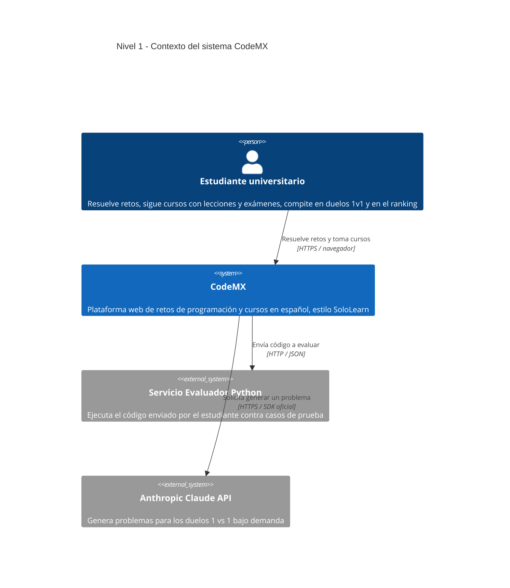
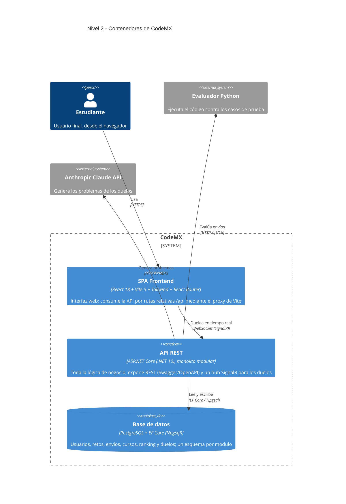

# CodeMX

Plataforma web de retos de programación y cursos en español, pensada para
estudiantes universitarios mexicanos (estilo SoloLearn). Permite resolver retos,
evaluar el código contra casos de prueba, seguir cursos con lecciones y exámenes,
y competir en un ranking.

## Stack

| Capa | Tecnología |
|------|------------|
| Frontend | React 18 + Vite 5 + Tailwind CSS + React Router |
| Backend | ASP.NET Core Web API (C#, **.NET 10**) |
| Persistencia | Entity Framework Core + Npgsql (**PostgreSQL**), un esquema por módulo |
| Documentación de la API | Swagger / OpenAPI (Swashbuckle) |
| Evaluador de código | Servicio Python externo por HTTP (opcional; hay estrategia local de respaldo) |

Es un **monolito modular**: el backend se divide en módulos por dominio
(`usuarios`, `retos`, `envios`, `evaluacion`, `ranking`, `cursos`), cada uno con
su interfaz pública. Ver las decisiones de arquitectura en los archivos `ADR-0X-*.md`.

### Patrones de diseño (GoF) en el backend

- **Strategy** — `IEvaluacionStrategy` con dos implementaciones intercambiables:
  `EvaluacionRemotaStrategy` (servicio Python) y `EvaluacionLocalStrategy`.
- **Factory Method** — `EvaluadorStrategyFactory` crea la estrategia según
  `TipoEvaluacion`; el servicio intenta la remota y cae a la local.
- **Observer** — el módulo *Envíos* publica un evento cuando un envío es aceptado;
  `RankingEnvioObserver` se suscribe y actualiza el ranking, sin acoplar Envíos a Ranking.

---

## Cómo prender el proyecto (básico)

### Requisitos previos

- [.NET SDK 10](https://dotnet.microsoft.com/download) (`dotnet --version`)
- [Node.js 18+](https://nodejs.org/) y npm (`node --version`)
- [PostgreSQL](https://www.postgresql.org/) corriendo en `localhost:5432`
  - Base/usuario por defecto: `Database=codemx_api`, `Username=postgres`, sin contraseña.
  - Ajusta la cadena de conexión en `backend/appsettings.json` si tu Postgres es distinto.
  - El backend **crea las tablas y siembra retos de ejemplo automáticamente** al arrancar
    (`EnsureCreated` + `DataSeeder`), no hace falta correr migraciones a mano.

### 1) Backend (.NET)

```bash
cd backend
dotnet run
```

Queda escuchando en `http://0.0.0.0:8080`.
Documentación interactiva de la API: `http://localhost:8080/swagger`

### 2) Frontend (React + Vite)

En otra terminal:

```bash
cd frontend
npm install        # solo la primera vez
npm run dev
```

Queda en `http://localhost:5173`. Vite reenvía las llamadas `/api/*` al backend
en `localhost:8080` mediante un *proxy*, así que el frontend usa rutas relativas
y no hay URLs incrustadas que cambiar.

> Abre `http://localhost:5173` en el navegador y listo.

---

## Acceder desde otra máquina (red local / LAN)

Por defecto un proyecto de desarrollo solo escucha en `localhost`, por lo que
otra computadora de la red **no puede alcanzarlo**. Para permitirlo, ambos
servidores se configuraron para escuchar en `0.0.0.0` (todas las interfaces de red).

### Lo que se cambió

| Archivo | Cambio | Por qué |
|---------|--------|---------|
| `backend/appsettings.json` | `Urls`: `http://localhost:8080` → `http://0.0.0.0:8080` | Que Kestrel acepte conexiones de cualquier interfaz, no solo la local. |
| `backend/Properties/launchSettings.json` | `applicationUrl` → `http://0.0.0.0:8080`; `launchBrowser` → `false` | `launchSettings` define `ASPNETCORE_URLS` al usar `dotnet run` y **tiene prioridad** sobre `appsettings.json`; había que cambiarlo aquí también. |
| `frontend/vite.config.js` | Añadido `server.host: true` | Hace que Vite escuche en `0.0.0.0` y exponga la URL de red. El *proxy* sigue apuntando a `localhost:8080` porque corre en la misma máquina que el backend. |

### Cómo usarlo

1. Levanta backend y frontend como se explica arriba (en la máquina "servidor").
2. Averigua la IP de esa máquina en la red:
   ```bash
   ip -4 addr | grep inet      # busca algo como 192.168.x.x
   ```
3. Desde la otra computadora (en la **misma red**), abre en el navegador:
   ```
   http://<IP-DEL-SERVIDOR>:5173
   ```
   El navegador externo llega a Vite (5173), que reenvía `/api` al backend .NET (8080),
   que consulta PostgreSQL. Toda la cadena funciona sin tocar más código.

> **Swagger directo** (opcional): `http://<IP-DEL-SERVIDOR>:8080/swagger`

### Si no conecta

- **Firewall** de la máquina servidor: abre los puertos.
  ```bash
  sudo ufw allow 5173/tcp && sudo ufw allow 8080/tcp                    # ufw
  # o:  sudo firewall-cmd --add-port=5173/tcp --add-port=8080/tcp       # firewalld
  ```
- Verifica que ambas máquinas estén en la **misma red** (no una en Wi-Fi de invitados).
- Confirma que el backend imprima `Now listening on: http://0.0.0.0:8080` al arrancar.

> Nota: esto habilita el acceso en **red local (LAN)**. Para exponerlo a **internet**
> se necesita un túnel (`ngrok`, `cloudflared`) o un despliegue en la nube.

---

## Estructura del repositorio

```
CodeMX-/
├── ADR-0X-*.md          Architecture Decision Records (decisiones de diseño)
├── backend/             API ASP.NET Core (.NET 10)
│   ├── Controllers/     (vacío; los controllers viven en Gateway)
│   ├── Gateway/         Controllers REST por recurso (entrada de la API)
│   ├── Modules/         Módulos por dominio (Usuarios, Retos, Envios, Evaluacion, Ranking, Cursos)
│   ├── Persistence/     DbContext de EF Core + sembrado de datos
│   ├── Program.cs       Composición: DI, CORS, Swagger, arranque
│   └── appsettings.json Configuración (URL, conexión a Postgres, evaluador)
└── frontend/            App React + Vite
    ├── src/api/         Cliente HTTP hacia /api
    ├── src/pages/       Páginas (Inicio, Cursos, Reto, Examen, Ranking…)
    └── vite.config.js   Servidor de desarrollo + proxy a /api
```

---

# Arquitectura — Modelo C4

Arquitectura de CodeMX descrita con el **Modelo C4**, versionada como código. Los
diagramas están escritos en **Mermaid** (GitHub los renderiza automáticamente). El C4
describe el sistema con *zoom* progresivo: Nivel 1 (contexto) → Nivel 2 (contenedores)
→ Nivel 3 (componentes).

## Nivel 1 — Contexto

> **¿Para quién es?** Para cualquiera, incluidos no técnicos (profesores, evaluadores).
> **¿Qué pregunta responde?** *¿Qué es CodeMX, quién lo usa y con qué sistemas externos
> habla?* — sin entrar en tecnología interna.



**Lectura:** el único usuario es el **estudiante**. CodeMX se apoya en dos sistemas
externos: el **evaluador Python** (decide si el código pasa los casos de prueba) y la
**API de Claude** (inventa los problemas de los duelos).

## Nivel 2 — Contenedores

> **¿Para quién es?** Para el equipo técnico. **¿Qué pregunta responde?** *¿De qué piezas
> ejecutables se compone CodeMX, con qué tecnología y cómo se comunican?* Un "contenedor"
> en C4 es algo que corre por separado (una app, una API, una base de datos), no un
> contenedor de Docker.



**Lectura:** son **tres contenedores propios**. El **SPA de React** solo pinta la interfaz
y llama al backend por el proxy `/api`. La **API .NET** concentra la lógica y habla con la
**base PostgreSQL** (EF Core), el **evaluador Python** (HTTP) y la **API de Claude** (SDK).
Los duelos usan un canal aparte en **tiempo real (SignalR/WebSocket)**, no REST.
