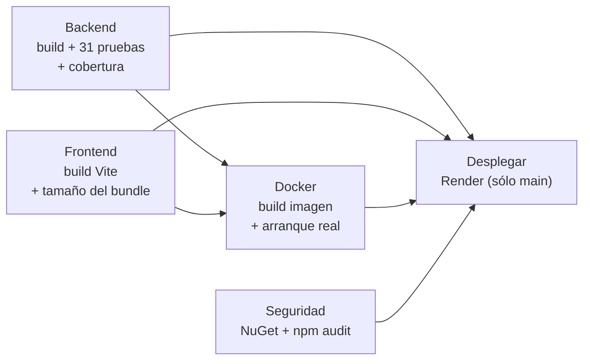
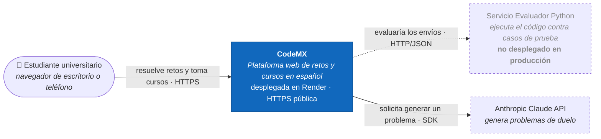
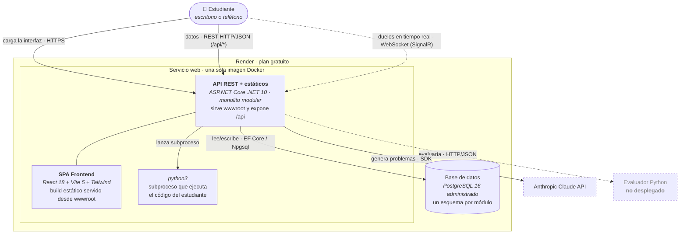
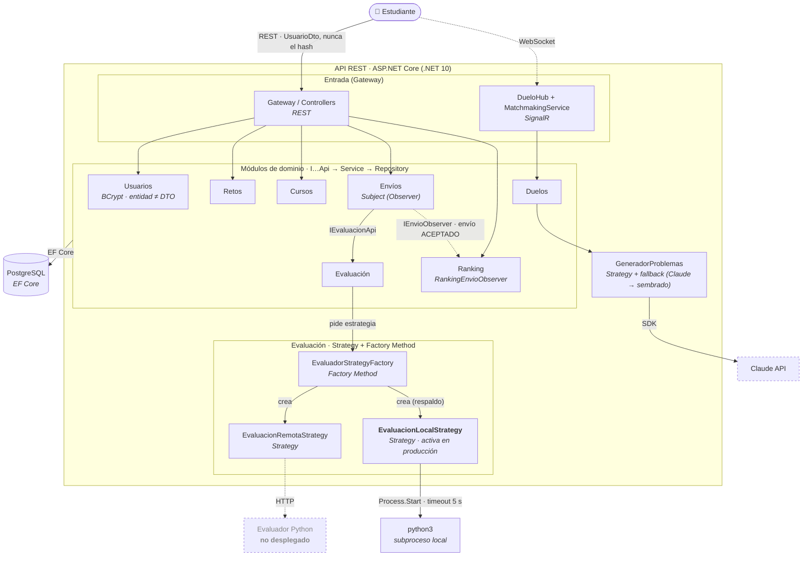

# CodeMX

[](https://github.com/Cab5ter/CodeMX-/actions/workflows/ci.yml)


Plataforma web de retos de programación y cursos en español, pensada para
estudiantes universitarios mexicanos (estilo SoloLearn). Permite resolver retos,
evaluar el código contra casos de prueba, seguir cursos con lecciones y exámenes,
y competir en un ranking.

---

## 🚀 Demo en vivo

### **[https://codemx.onrender.com](https://codemx.onrender.com)**


Abierta desde cualquier dispositivo y cualquier red — **escanea el QR con la cámara del
teléfono**. La interfaz está adaptada a pantallas de móvil.

**Qué puedes probar:**

- Crear una cuenta y entrar (la contraseña se hashea con BCrypt, ADR-07)
- Resolver un reto: el código se ejecuta contra casos de prueba reales
- Ver cómo tu envío aceptado sube al ranking automáticamente
- Seguir un curso con lecciones y examen
- Modo **1 vs 1** en tiempo real (abre la página en dos dispositivos)
- El contrato de la API en **[/swagger](https://codemx.onrender.com/swagger)**

> **Antes de abrirla:** el plan gratuito de Render suspende el servicio tras ~15 minutos sin
> tráfico. El primer acceso puede tardar cerca de un minuto en despertar; los siguientes son
> inmediatos. Es el trade-off **TO-01** de la [evaluación ATAM](ATAM-CodeMX.md).

<br clear="right" />

**Pipeline en vivo:** [pestaña Actions](https://github.com/Cab5ter/CodeMX-/actions) — cinco
jobs, 31 pruebas, con la imagen Docker arrancada y verificada en cada push.

## Stack

| Capa | Tecnología |
|------|------------|
| Frontend | React 18 + Vite 5 + Tailwind CSS + React Router |
| Backend | ASP.NET Core Web API (C#, **.NET 10**) |
| Persistencia | Entity Framework Core + Npgsql (**PostgreSQL**), un esquema por módulo |
| Documentación de la API | Swagger / OpenAPI (Swashbuckle) |
| Evaluador de código | Servicio Python externo por HTTP (opcional; hay estrategia local de respaldo) |

Es un **monolito modular**: el backend se divide en módulos por dominio
(`usuarios`, `retos`, `envios`, `evaluacion`, `ranking`, `cursos`), cada uno con
su interfaz pública. Ver las decisiones de arquitectura en los archivos `ADR-0X-*.md`.

### Patrones de diseño (GoF) en el backend

- **Strategy** — `IEvaluacionStrategy` con dos implementaciones intercambiables:
  `EvaluacionRemotaStrategy` (servicio Python) y `EvaluacionLocalStrategy`.
- **Factory Method** — `EvaluadorStrategyFactory` crea la estrategia según
  `TipoEvaluacion`; el servicio intenta la remota y cae a la local.
- **Observer** — el módulo *Envíos* publica un evento cuando un envío es aceptado;
  `RankingEnvioObserver` se suscribe y actualiza el ranking, sin acoplar Envíos a Ranking.

---

## Deuda técnica identificada

### DT-01 — Autenticación y exposición de credenciales inseguras

**Estado:** abierta<br>
**Prioridad:** crítica<br>
**Tipo:** seguridad y diseño<br>
**Componentes afectados:** frontend, API de Usuarios y base de datos

#### Evidencia

Aunque el atributo se llama `PasswordHash`, actualmente la aplicación trata su valor
como una contraseña en texto plano:

- `frontend/src/pages/Registro.jsx` y `frontend/src/pages/Login.jsx` capturan la
  contraseña en `passwordHash` y la envían directamente a la API.
- `backend/Modules/Usuarios/UsuarioService.cs` autentica mediante la comparación
  `usuario.PasswordHash == passwordHash`; no existe una función de hash ni una
  verificación criptográfica.
- `backend/Gateway/UsuariosController.cs` devuelve la entidad `Usuario` completa en
  las operaciones de creación, consulta, listado e inicio de sesión. Por lo tanto, el
  campo `PasswordHash` forma parte de las respuestas JSON.
- No existe un mecanismo de sesión o token. El frontend conserva únicamente el objeto
  del usuario y otras operaciones confían en identificadores de usuario enviados por
  el cliente.

#### Impacto

Una lectura de la base de datos o una respuesta interceptada permite obtener las
contraseñas reutilizables de los usuarios. Además, cualquier consumidor de la API
puede consultar la lista de usuarios y recibir sus credenciales. La ausencia de
autenticación verificable también permite suplantar a otro usuario enviando su
identificador en solicitudes de envíos, cursos o duelos.

Esta deuda debe resolverse antes de publicar CodeMX fuera de un entorno local. Su
severidad es **crítica** porque compromete confidencialidad, autenticidad y datos de
todos los usuarios.

#### Propuesta concreta de solución

1. **Separar contratos y entidad.** Crear DTOs específicos: `RegistroRequest`,
   `LoginRequest` y `UsuarioResponse`. Los DTOs de entrada recibirán `Password`; el DTO
   de salida solo expondrá `Id`, `Nombre`, `Email` y `CreadoEn`. La entidad de
   persistencia conservará `PasswordHash`, marcado además con `[JsonIgnore]` como
   defensa adicional.
2. **Aplicar hash seguro en el servidor.** Incorporar `IPasswordHasher<Usuario>` de
   ASP.NET Core Identity (PBKDF2 con salt por usuario). Al registrar, guardar el
   resultado de `HashPassword`; al iniciar sesión, usar `VerifyHashedPassword`. La
   contraseña nunca se debe registrar en logs, devolver por JSON ni persistir sin hash.
3. **Implementar autenticación.** Emitir un token JWT de corta duración después de un
   login válido, configurar `AddAuthentication().AddJwtBearer()` y proteger las rutas
   privadas con `[Authorize]`. El backend debe tomar el identificador del usuario desde
   los *claims* del token, no desde un valor confiado al cliente.
4. **Migrar datos existentes.** Como no es posible transformar contraseñas planas en
   hashes sin conocer de forma segura su procedencia, invalidar las credenciales
   actuales y solicitar restablecimiento. Agregar una migración de EF Core que limite
   la longitud y nulabilidad de `PasswordHash`; sustituir `EnsureCreated()` por
   `Database.Migrate()` para que el cambio sea reproducible.
5. **Añadir pruebas automatizadas.** Cubrir registro, login correcto e incorrecto,
   respuestas sin `PasswordHash`, acceso sin token (`401`) y rechazo de un `usuarioId`
   que no coincida con el sujeto autenticado.

#### Criterios de aceptación

- Ninguna respuesta de `/api/usuarios` contiene `Password` ni `PasswordHash`.
- La contraseña almacenada no coincide con la recibida y se valida mediante un
  algoritmo de hash con salt.
- Las rutas privadas responden `401` sin un token válido y `403` cuando el usuario no
  tiene permiso sobre el recurso.
- La identidad usada para crear envíos, registrar progreso y participar en duelos se
  obtiene del token autenticado.
- Las pruebas de autenticación y autorización se ejecutan automáticamente en CI.

#### Estimación y seguimiento

| Fase | Trabajo | Estimación |
|------|---------|------------|
| 1 | DTOs, ocultamiento de credenciales y hash de contraseñas | 1 día |
| 2 | JWT, autorización de endpoints y adaptación del frontend | 2 días |
| 3 | Migración, pruebas de integración y documentación de configuración | 1–2 días |

**Estimación total:** 4–5 días de desarrollo. El trabajo puede dividirse en entregas,
pero las fases 1 y 2 deben desplegarse juntas para no mantener contratos inseguros.

### Riesgo técnico relacionado — ejecución local de código

`backend/Modules/Evaluacion/EvaluacionLocalStrategy.cs` escribe código proporcionado
por el usuario en un archivo temporal y lo ejecuta con `python3` en el mismo sistema
operativo que la API. El límite de tiempo detiene procesos largos, pero no restringe
acceso a archivos, red, memoria, CPU ni llamadas al sistema. Por ello, esta estrategia
de respaldo no debe habilitarse en un entorno compartido o de producción.

La remediación propuesta es ejecutar cada evaluación en un *sandbox* aislado
(contenedor efímero sin red, usuario sin privilegios, sistema de archivos de solo
lectura y límites de CPU, memoria, procesos y tiempo). La API debe comunicarse
exclusivamente con ese servicio; si no está disponible, el envío debe permanecer en
cola o devolver un error controlado, sin ejecutar código dentro del proceso anfitrión.
Se considera resuelto cuando pruebas de escape confirman que el programa evaluado no
puede leer archivos del host, abrir conexiones ni exceder los recursos asignados.

---

## Cómo prender el proyecto (básico)

### Requisitos previos

- [.NET SDK 10](https://dotnet.microsoft.com/download) (`dotnet --version`)
- [Node.js 18+](https://nodejs.org/) y npm (`node --version`)
- [PostgreSQL](https://www.postgresql.org/) corriendo en `localhost:5432`
  - Base/usuario por defecto: `Database=codemx_api`, `Username=postgres`, sin contraseña.
  - Ajusta la cadena de conexión en `backend/appsettings.json` si tu Postgres es distinto.
  - El backend **crea las tablas y siembra retos de ejemplo automáticamente** al arrancar
    (`EnsureCreated` + `DataSeeder`), no hace falta correr migraciones a mano.

### 1) Backend (.NET)

```bash
cd backend
dotnet run
```

Queda escuchando en `http://0.0.0.0:8080`.
Documentación interactiva de la API: `http://localhost:8080/swagger`

### 2) Frontend (React + Vite)

En otra terminal:

```bash
cd frontend
npm install        # solo la primera vez
npm run dev
```

Queda en `http://localhost:5173`. Vite reenvía las llamadas `/api/*` al backend
en `localhost:8080` mediante un *proxy*, así que el frontend usa rutas relativas
y no hay URLs incrustadas que cambiar.

> Abre `http://localhost:5173` en el navegador y listo.

---

## Acceder desde otra máquina (red local / LAN)

Por defecto un proyecto de desarrollo solo escucha en `localhost`, por lo que
otra computadora de la red **no puede alcanzarlo**. Para permitirlo, ambos
servidores se configuraron para escuchar en `0.0.0.0` (todas las interfaces de red).

### Lo que se cambió

| Archivo | Cambio | Por qué |
|---------|--------|---------|
| `backend/appsettings.json` | `Urls`: `http://localhost:8080` → `http://0.0.0.0:8080` | Que Kestrel acepte conexiones de cualquier interfaz, no solo la local. |
| `backend/Properties/launchSettings.json` | `applicationUrl` → `http://0.0.0.0:8080`; `launchBrowser` → `false` | `launchSettings` define `ASPNETCORE_URLS` al usar `dotnet run` y **tiene prioridad** sobre `appsettings.json`; había que cambiarlo aquí también. |
| `frontend/vite.config.js` | Añadido `server.host: true` | Hace que Vite escuche en `0.0.0.0` y exponga la URL de red. El *proxy* sigue apuntando a `localhost:8080` porque corre en la misma máquina que el backend. |

### Cómo usarlo

1. Levanta backend y frontend como se explica arriba (en la máquina "servidor").
2. Averigua la IP de esa máquina en la red:
   ```bash
   ip -4 addr | grep inet      # busca algo como 192.168.x.x
   ```
3. Desde la otra computadora (en la **misma red**), abre en el navegador:
   ```
   http://<IP-DEL-SERVIDOR>:5173
   ```
   El navegador externo llega a Vite (5173), que reenvía `/api` al backend .NET (8080),
   que consulta PostgreSQL. Toda la cadena funciona sin tocar más código.

> **Swagger directo** (opcional): `http://<IP-DEL-SERVIDOR>:8080/swagger`

### Si no conecta

- **Firewall** de la máquina servidor: abre los puertos.
  ```bash
  sudo ufw allow 5173/tcp && sudo ufw allow 8080/tcp                    # ufw
  # o:  sudo firewall-cmd --add-port=5173/tcp --add-port=8080/tcp       # firewalld
  ```
- Verifica que ambas máquinas estén en la **misma red** (no una en Wi-Fi de invitados).
- Confirma que el backend imprima `Now listening on: http://0.0.0.0:8080` al arrancar.

> Nota: esto habilita el acceso en **red local (LAN)**. Para exponerlo a **internet**
> se necesita un túnel (`ngrok`, `cloudflared`) o un despliegue en la nube.

---

## Pruebas e integración continua

**31 pruebas unitarias con xUnit**, escritas con el patrón Arrange-Act-Assert, repartidas
en dos proyectos:

| Proyecto | Pruebas | Qué cubre |
|----------|---------|-----------|
| `tests/CodeMX.Domain.Tests/` | 15 | Modelo de dominio aislado: `Challenge`, `Submission`, `Leaderboard` |
| `tests/CodeMX.Api.Tests/` | 16 | Backend real: hashing BCrypt, validación de registro, autenticación y no filtración del hash en el JSON |

Para ejecutarlas, desde la raíz del repositorio:

```bash
dotnet restore CodeMX.sln
dotnet build   CodeMX.sln --configuration Release
dotnet test    CodeMX.sln --configuration Release
```

### El pipeline

Cada push y cada Pull Request disparan el workflow (`.github/workflows/ci.yml`), con
**cinco jobs**. El check verde o rojo aparece en la pestaña *Actions* y en el Pull Request.



Lo que hace cada job:

1. **Backend** — restaura con caché de NuGet, compila en Release, ejecuta las 31 pruebas
   con cobertura (coverlet) y publica en el *Job Summary* cuántas pasaron, cuáles fallaron
   y el porcentaje de líneas cubiertas. Sube los `.trx` y el reporte como artefactos.
2. **Frontend** — `npm ci` con caché, build de producción y tabla con el tamaño de cada
   archivo del bundle. Sube `dist/` como artefacto.
3. **Docker** — construye la imagen con caché de capas, la **arranca de verdad** contra un
   PostgreSQL de servicio y verifica que responden `/health`, la API, el frontend, una
   ruta de React Router y Swagger. Si algo falla, vuelca el log del contenedor.
4. **Seguridad** — audita dependencias vulnerables conocidas en NuGet y npm.
5. **Desplegar** — sólo en `main` y sólo si los cuatro anteriores pasaron: dispara el
   deploy hook de Render y espera a que `/health` de la demo responda.

Ver el **ADR-06 (Pruebas y Pipeline CI)** para el detalle de qué se prueba y por qué.

---

## Estructura del repositorio

```
CodeMX-/
├── ADR-0X-*.md          Architecture Decision Records (decisiones de diseño)
├── ATAM-CodeMX.md       Evaluación ATAM: riesgos, trade-offs y sensibilidad
├── .github/workflows/   Pipeline de CI (GitHub Actions), 5 jobs
├── Dockerfile           Imagen única: la API sirve también el frontend
├── render.yaml          Infraestructura de la demo (web service + PostgreSQL)
├── CodeMX.sln           Solución .NET: dominio + API + los dos proyectos de prueba
├── src/CodeMX.Domain/   Modelo de dominio con pruebas unitarias
├── tests/
│   ├── CodeMX.Domain.Tests/  15 pruebas del dominio
│   └── CodeMX.Api.Tests/     16 pruebas del backend real
├── backend/             API ASP.NET Core (.NET 10)
│   ├── Gateway/         Controllers REST por recurso (entrada de la API)
│   ├── Modules/         Módulos por dominio (Usuarios, Retos, Envios, Evaluacion, Ranking, Cursos, Duelos)
│   ├── Persistence/     DbContext de EF Core + sembrado de datos
│   ├── RealTime/        Hub de SignalR y emparejamiento del modo 1 vs 1
│   ├── Program.cs       Composición: DI, CORS, Swagger, estáticos, arranque
│   └── appsettings.json Configuración (URL, conexión a Postgres, evaluador)
└── frontend/            App React + Vite
    ├── src/api/         Cliente HTTP hacia /api
    ├── src/pages/       Páginas (Inicio, Cursos, Reto, Examen, Ranking…)
    └── vite.config.js   Servidor de desarrollo + proxy a /api
```

---

# Arquitectura — Modelo C4

Arquitectura de CodeMX descrita con el **Modelo C4**, versionada como código. Los
diagramas están escritos en **Mermaid** (GitHub los renderiza automáticamente). El C4
describe el sistema con *zoom* progresivo: Nivel 1 (contexto) → Nivel 2 (contenedores)
→ Nivel 3 (componentes).

> **Actualizado al 30/07/2026**, tras el despliegue público (ADR-08) y el cambio en el
> manejo de credenciales (ADR-07). Los diagramas reflejan lo que corre en producción, no
> un diseño ideal: donde la realidad desplegada difiere de la intención original, se marca.

## Nivel 1 — Contexto

> **¿Para quién es?** Para cualquiera, incluidos no técnicos (profesores, evaluadores).
> **¿Qué pregunta responde?** *¿Qué es CodeMX, quién lo usa y con qué sistemas externos
> habla?* — sin entrar en tecnología interna.



**Lectura:** el único usuario es el **estudiante**, que ahora entra desde cualquier red y
cualquier dispositivo gracias al despliegue público. CodeMX se apoya en dos sistemas
externos: el **evaluador Python** y la **API de Claude** (inventa los problemas de los
duelos).

**Diferencia con producción:** el evaluador Python **no está desplegado** (ADR-08). En la
demo actúa la estrategia local de respaldo, que ejecuta el código dentro del propio
contenedor — es el riesgo **R-03** de la [evaluación ATAM](ATAM-CodeMX.md).

## Nivel 2 — Contenedores

> **¿Para quién es?** Para el equipo técnico. **¿Qué pregunta responde?** *¿De qué piezas
> ejecutables se compone CodeMX, con qué tecnología y cómo se comunican?* Un "contenedor"
> en C4 es algo que corre por separado (una app, una API, una base de datos), no un
> contenedor de Docker.



**Lectura:** en producción hay **un solo contenedor propio más la base de datos**. El build
del SPA de React viaja **dentro de la misma imagen** que la API, servido desde `wwwroot`
(ADR-08): mismo origen, sin CORS y sin posibilidad de que frontend y API queden
desincronizados. Las rutas relativas `/api` del cliente funcionan igual que con el proxy de
Vite en desarrollo. Los duelos usan un canal aparte en **tiempo real (SignalR/WebSocket)**,
no REST.

**Cambio respecto a la versión anterior del diagrama:** antes el SPA y la API figuraban como
dos contenedores separados. Siguen siendo dos *piezas de desarrollo* —y en local se ejecutan
por separado, Vite en `:5173` y la API en `:8080`— pero **un único contenedor desplegable**.
Ese es el trade-off **TO-02** del ATAM.

## Nivel 3 — Componentes (dentro de la API REST)

> **¿Para quién es?** Para quien programa dentro del backend. **¿Qué pregunta responde?**
> *¿Qué controladores, servicios de dominio y patrones de diseño forman la API y cómo
> colaboran?* Aquí se ven los **patrones GoF** implementados: **Strategy**, **Factory
> Method** y **Observer**.



**Lectura y patrones GoF:**

- **Módulos.** Cada módulo expone una **interfaz pública** (`I…Api`) y esconde su
  `Service` + `Repository`; los módulos se hablan solo por esas interfaces (monolito
  modular, ADR-03).
- **Frontera de credenciales (ADR-07).** El módulo Usuarios recibe la contraseña en claro,
  la hashea con BCrypt y **nunca deja salir el hash**: el gateway responde siempre con
  `UsuarioDto`. Es la única parte del sistema que sabe cómo se almacena una credencial.
- **Strategy** — `IEvaluacionStrategy` con dos implementaciones intercambiables:
  `EvaluacionRemotaStrategy` (evaluador Python) y `EvaluacionLocalStrategy` (respaldo). El
  mismo patrón aparece en Duelos con `IGeneradorProblemas` (Claude vs. sembrado).
- **Factory Method** — `EvaluadorStrategyFactory` decide **qué** estrategia crear según el
  `TipoEvaluacion` e intenta la remota, cayendo a la local.
- **Observer** — `EnvioService` (sujeto) publica `EnvioAceptadoEvent` al aceptar un envío
  por primera vez; `RankingEnvioObserver` está suscrito como `IEnvioObserver` y actualiza
  el ranking. Así **Envíos no conoce a Ranking** y podrían sumarse otros observadores
  (logros, notificaciones) sin tocar Envíos.

**Qué estrategia corre en producción.** Como el evaluador Python no se desplegó, la que
actúa es `EvaluacionLocalStrategy`: lanza `python3` como subproceso del propio backend, con
un timeout de 5 segundos como única contención. El patrón Strategy hizo que ese respaldo
entrara **sin tocar una línea** del resto del sistema — es el escenario E-05 del ATAM
resuelto en la práctica. El precio es el riesgo **R-03**: se ejecuta código no confiable
dentro del contenedor de una aplicación pública.

---

## Declaración de uso de IA

Los **diagramas y textos de arquitectura** de este README se elaboraron con apoyo de
**Claude Code (Claude Opus 4.8)**, a partir de la lectura del código real del repositorio
(`Program.cs`, `backend/Modules/`, los controladores del `Gateway/` y el hub de tiempo
real). El contenido se revisó para que refleje la arquitectura efectivamente implementada.
El modelo C4 elegido y las decisiones de diseño descritas corresponden al autor del
proyecto.
